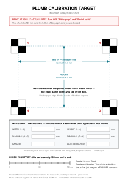
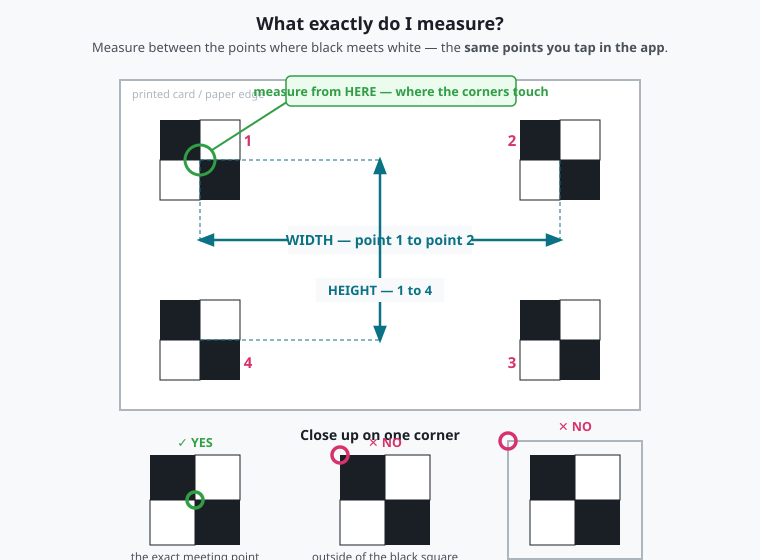
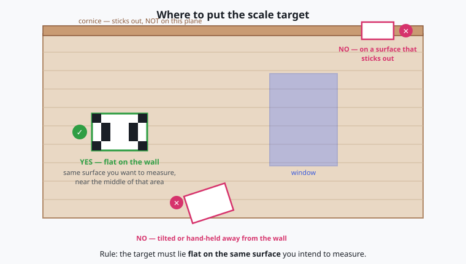
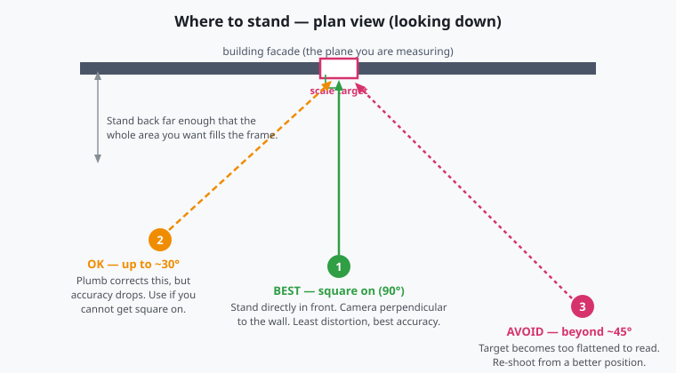
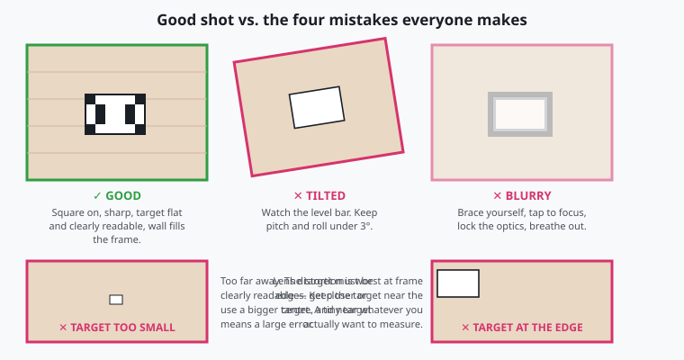
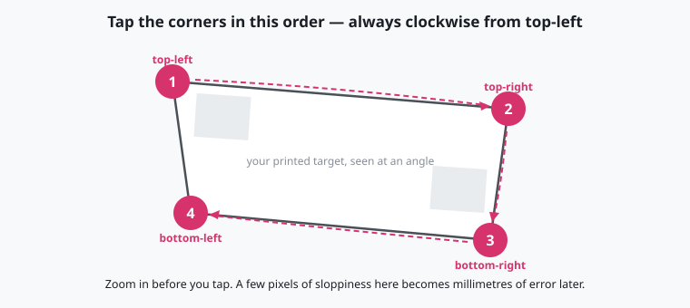
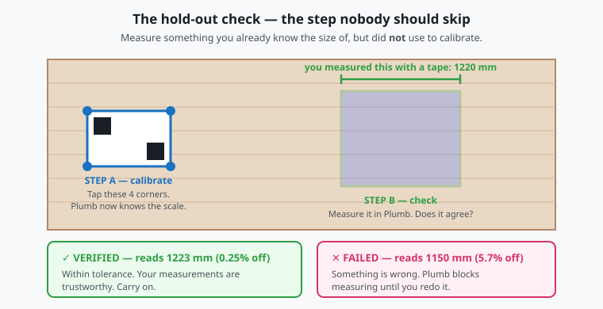
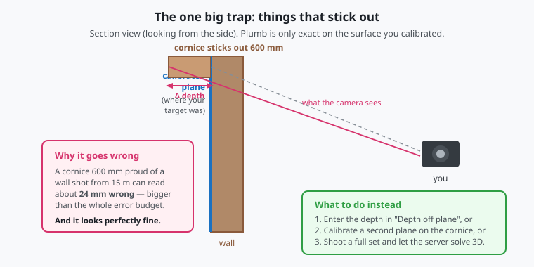

# How to Plumb

**Measure a building with your phone.**

📱 **The app: <https://ethical-tech-colab.github.io/plumb/>** — opens in your browser, nothing to install.

---

## The idea in one picture

A photo can't tell anyone how wide that window is.

A photo **with a ruler of known size in it** can. That's the whole trick — everything below is just
doing it carefully enough that the number is trustworthy.

So the job has two halves:

| Half | Where | Takes |
|---|---|---|
| **Make the ruler** — print a card and measure it | at home, once | 10 minutes |
| **Use it** — photograph a wall with the card in shot | at the building, every time | 5 minutes |

---

## Contents

**Part 1 — At home (do this once)**
1. [Print the card](#step-1--print-the-card)
2. [Check the print came out right](#step-2--check-the-print-came-out-right)
3. [Measure the card](#step-3--measure-the-card) ← the step that matters most

**Part 2 — At the building (every time)**

4. [Put the card on the wall](#step-4--put-the-card-on-the-wall)
5. [Stand square on](#step-5--stand-square-on)
6. [Take the photos](#step-6--take-the-photos)
7. [Calibrate](#step-7--calibrate)
8. [Check your work](#step-8--check-your-work)
9. [Measure, save, upload](#step-9--measure-save-upload)

**Reference**

- [The one big trap](#the-one-big-trap)
- [Common mistakes](#common-mistakes)
- [Print this: field card](#print-this-field-card)
- [Glossary](#glossary)

---

## What you need

| | | Cost |
|---|---|---|
| 📱 **A phone** | Android + Chrome is best. iPhone works with fewer features — the app tells you which you've got | — |
| 🖨️ **A printed card** | [A4](docs/assets/target-a4.svg) · [US Letter](docs/assets/target-letter.svg) | ~$1 |
| 📏 **A steel rule** | To measure the card. *Not* a tape measure — [why](#why-a-steel-rule-and-not-a-tape) | ~$10 |
| 📋 **Stiff card or foam board** | To glue the printed card to, so it can't bend | ~$5 |
| 📐 *Optional:* a tape measure | For the [check](#step-8--check-your-work) at the building | — |

---
---

# Part 1 — At home

Do this once. The result is a "ruler" you'll reuse at every building.

## Step 1 · Print the card

Download and print **one** of these:

| Paper | Download |
|---|---|
| **A4** — most of the world | **[target-a4.svg](docs/assets/target-a4.svg)** |
| **US Letter** — US, Canada | **[target-letter.svg](docs/assets/target-letter.svg)** |

Both have the same target on them, so it makes no difference which you use.

**In the print dialog:**

- ✅ Scale: **100%** or **"Actual size"**
- ❌ Turn **off** "Fit to page" / "Shrink to fit" / "Scale to fit media"
- Plain white paper. **Matte, not glossy** — glossy reflects and hides the corners.

### This is exactly what comes out



Everything you need is printed on the card itself — the dimensions to measure, boxes to write them
in, and a bar to check your printer. **You don't need to remember any of this in the field.**

The four corners are **checkerboards**. Where the black and white squares touch is called a *saddle
point*, and it's the reason the card looks like this: it's the most precisely locatable mark you can
print. You can see it exactly by eye, and later the software can find it to a fraction of a pixel.

> 🎯 **That meeting point is the whole game.** It's what you measure between, and it's what you tap
> in the app. Same point, both times.

---

## Step 2 · Check the print came out right

Find the **100 mm bar** near the bottom of the card. Put your steel rule on it.

| It reads | Meaning | Do |
|---|---|---|
| **100 mm** | Printer is accurate | Carry on |
| **97 mm**, or anything else | Printer scaled the page | **Carry on anyway** — you're about to measure the real card |

Either way you're fine, because you never tell the app the *nominal* size — you tell it what you
actually measured. That's the entire reason this step exists.

> **Why this matters so much:** printers routinely scale by 1–3% from margins and driver defaults.
> If you typed `150` but the card really printed at `145.5`, every measurement you ever took with it
> would be **3% wrong**. A 3 m wall would read 3.09 m. And nothing on screen would look wrong.

---

## Step 3 · Measure the card

**This is the most important step in the guide.** Get this right and everything downstream works.

### Measure between the points where black meets white



| ✅ Measure between these | ❌ Never these |
|---|---|
| The points where black touches white | The outer corners of the black squares |
| | The edge of the paper |
| | The dashed guide rectangle |

> Measuring to the paper edge instead of the pattern is out by about 12 mm on a 150 mm card — an
> **8% error** on everything you go on to measure.

### Take four measurements

Write them in the boxes printed on the card:

| Measure | From → to | Should be about |
|---|---|---|
| **Width** | ① → ② | 150 mm |
| **Height** | ① → ④ | 100 mm |
| **Diagonal** | ① → ③ | 180 mm |
| **Diagonal** | ② → ④ | 180 mm |

**Only width and height go into the app.** The two diagonals are a squareness check: if they differ
by more than about 1 mm, the print came out skewed — print it again.

### Why a steel rule and not a tape

A tape measure has a **sliding hook** on the end (deliberately — it slides by exactly the thickness
of the hook) and it **sags** across a span. Both cost you a millimetre or two. A steel rule has
neither problem.

- Lay the rule flat on the card and look **straight down** — reading at an angle adds parallax error
- Read to the nearest **0.5 mm**; that's ~0.3% on a 150 mm card, comfortably good enough
- Measure twice. If the readings disagree, measure a third time

### Finish the card

- **Glue it to stiff card or foam board.** A card that bows in the middle throws its own corners out
  of plane, which quietly corrupts everything.
- **Write the measured numbers on the back**, with the date.
- **Re-measure if it gets damp or warped.** Paper genuinely moves with humidity.
- Making several? Give each an **ID** so you know which numbers belong to which card.

### No printer?

You don't strictly need one. Anything flat and rigid whose size you've measured will do — a window
opening, a door, a panel, ten brick courses divided by ten. Same rule: **measure between the exact
points you're going to tap.**

---
---

# Part 2 — At the building

> ### ⚠️ Safety first, every time
> - Stay on public pavement unless you have permission to be on private property
> - **Never** step into a road, bike lane or rail corridor for a shot. Back up instead
> - Look up often — you're walking while staring at a screen
> - Don't block doorways, ramps or pedestrian flow
> - If someone asks you to stop, stop
> - **No photograph is worth an injury or a citation**

## Step 4 · Put the card on the wall

First decide **which flat surface** you're measuring — say, the brick face of the front wall. Plumb
measures one flat surface at a time. Type a note in the app: *"north facade, brick, ground floor"*.

Then put the card **flat against that same surface**, near the middle of the area you care about.



| ✅ | ❌ |
|---|---|
| Taped flat against the brick | Held in your hand |
| Propped square against the wall | Tilted at an angle |
| On the surface you're measuring | On a cornice, sill or anything that sticks out |

**Good walls to start with:** flat brick or stone, a plain facade, a shopfront, a door.
**Leave until later:** heavily carved surfaces, deep porches, anything with lots of projections.

---

## Step 5 · Stand square on



Stand **directly in front** of the wall, camera pointing straight at it — not off to one side, not
tilted up or down.

| Angle | Verdict |
|---|---|
| Straight on (90°) | **Best** |
| Up to ~30° off | Fine — Plumb corrects it |
| Beyond ~45° | **Re-shoot** — the card gets too squashed to read |

Stand back far enough that the area you want fills the frame, and **watch the level bar** at the top
of the screen. Keep pitch and roll under 3°; the app warns you when you're off.

---

## Step 6 · Take the photos

Plumb takes **two photos from the same spot**:

1. **With the card** in frame
2. **Clean** — same view, card removed

Why two? The official documentation standard (HABS) *requires* a photo with a scale in it. But you
also want a clean photograph for design work. So you get both.

**Before you tap the button:**

- Tap **Lock focus + exposure** — keeps the camera steady between shots *(Android)*
- Keep **zoom at 1.0×** — zooming breaks the calibration
- Brace your elbows against your body, breathe out, then tap
- Use **Full-res photo**, not "Freeze preview frame" — the preview is lower quality



---

## Step 7 · Calibrate

"Calibrating" just means telling Plumb how big things really are.



1. Type in the width and height **you measured in [Step 3](#step-3--measure-the-card)** — not 150 × 100
2. Tap **Pick 4 corners**
3. Tap the four **saddle points** — where black meets white — clockwise from top-left:
   ① → ② → ③ → ④
4. Tap **Solve calibration**

**Zoom in before each tap.** A few pixels of sloppiness here becomes millimetres of error later.

You'll see a badge appear: **CAL-3 · UNVERIFIED**. Plumb knows the scale but hasn't proved it's
right — that's the next step.

### Turn on the grid

Tap **Metric grid** and a real-world grid appears — 100 mm squares, or 1 foot, your choice.

On an angled photo the grid will **look like it converges into the distance**. That's correct. It's
what a real grid does in perspective, and it's your visual proof that Plumb has understood the
geometry of the shot.

Tap **Grid off** any time to see the clean photo. The grid is never baked into your original image.

---

## Step 8 · Check your work

**Don't skip this.** It's what separates a measurement from a guess.



Measure something you **already know**, that you did **not** use to calibrate:

1. Pick something on the wall you can measure with a tape — a window width, a door, ten brick courses
2. Measure it by hand and write it down
3. In the app: enter that known length, tap **Pick check points**, tap the two ends

| Result | Meaning |
|---|---|
| ✅ **VERIFIED** | Within tolerance. Your measurements are trustworthy |
| ❌ **FAILED** | Something's wrong — Plumb **blocks measuring** until you fix it |

> **Why it has to be something different:** checking your calibration against the same card you
> calibrated with proves nothing — of course it agrees with itself. Only an *independent* length
> proves it works.

**If the check fails, work down this list:**

| Check | Fix |
|---|---|
| Did you type the *measured* card size? | Re-measure the card |
| Was the card flat on the wall? | Re-shoot with it flat |
| Did you tap the saddle points accurately? | Zoom in, redo the corners |
| Is your check length on the same flat surface? | Pick a different feature |
| Was your hand measurement right? | Re-measure it |

Two checks beat one — do a horizontal and a vertical.

---

## Step 9 · Measure, save, upload

### Measure

Tap **Measure distance**, then tap the two points. You get:

```
window head width     1220.4 ± 4.1 mm (95%)
tier CAL-3 · calibration VERIFIED · USIBD LOA30
```

| Part | Meaning |
|---|---|
| `1220.4 mm` | The measurement |
| `± 4.1 mm (95%)` | Honest error range — the truth is almost certainly within this |
| `CAL-3` | How it was calibrated |
| `VERIFIED` | Your check passed |
| `LOA30` | The professional accuracy grade it meets |
| `PROVISIONAL` | On-phone estimate; the server produces a better final number later |

> **Never write down the number without the ±.** A measurement without its uncertainty isn't a
> measurement, it's a claim. Plumb won't export one, and neither should you.

### Save

| File | What it is |
|---|---|
| **Raw image** | Your original photo, untouched — no grid drawn on it, not re-compressed |
| **Overlay** | The grid and measurements, as a separate layer |
| **Annotated derivative** | Photo + grid combined, for reports |
| **Provenance sidecar** | Where, when, with what, by whom — and what it does *not* prove |

The original is **never** modified. Everything else can be regenerated; the original can't.

### Upload — Wi-Fi only by default 📶

Full-resolution photos are big. A day's work can be several gigabytes, so **Plumb won't upload over
cellular unless you tell it to.**

| Setting | Behaviour |
|---|---|
| **Wi-Fi only** *(default)* | Nothing goes over cellular. Ever |
| **Wi-Fi preferred** | Uses fast cellular if there's no Wi-Fi |
| **Any network** | Uploads on anything — watch your data plan |
| **Manual only** | Nothing uploads until you tap the button |

**Nothing is lost while it waits.** Captures sit safely in a queue on the phone and upload the moment
you're on Wi-Fi. If your phone's Data Saver is on, Plumb holds uploads regardless.

> ⚠️ **Before you finish for the day:** get on Wi-Fi and let the queue drain, or export a local copy.
> Phone browsers can clear storage when space runs low.

---
---

# Reference

## The one big trap



**Plumb is only exact on the surface you calibrated.**

Calibrate on the brick wall, then measure a cornice sticking out 600 mm, and your answer will be
wrong — while looking completely fine. From 15 m away that cornice can read about **24 mm out**,
which is bigger than the entire error budget.

**What to do:**

1. **Just measure things on the wall** — simplest and safest
2. **Tell Plumb the depth** — type it into "Depth off plane" and the error range widens honestly
3. **Calibrate a second plane** on the cornice itself
4. **Shoot a full overlapping set** and let the server build a 3D model

If you remember one thing from this guide, make it this one.

---

## Common mistakes

| Mistake | What happens | Fix |
|---|---|---|
| Printing with "fit to page" | Card is 1–3% wrong, so everything is | Print at 100%, check the 100 mm bar |
| Typing the nominal 150 × 100 | Wrong by however much the printer scaled | Type your **measured** numbers |
| Measuring to the paper edge | ~8% error | Measure where black meets white |
| Card held in hand, or tilted | Bad calibration | Tape it flat to the wall |
| Card bent or bowed | Corners fall out of plane | Glue it to stiff board |
| Skipping the check | You never find out it's wrong | Always do a hold-out check |
| Checking against your own card | Proves nothing | Use a *different* known length |
| Measuring things that stick out | Silently wrong | See [the one big trap](#the-one-big-trap) |
| Using zoom | Breaks calibration | Keep zoom 1.0×, walk closer |
| Card tiny in the frame | Large errors | Get closer, or print bigger |
| Card at the frame edge | Lens distortion | Keep it near the centre |
| Shooting into sun / deep shadow | Corners can't be found | Even light. Overcast is ideal |
| Writing a number without its ± | Not a measurement any more | Always carry the uncertainty |

---

## Print this: field card

```
┌─────────────────────────────────────────────────────┐
│  PLUMB — FIELD CARD                                 │
├─────────────────────────────────────────────────────┤
│  AT HOME (once)                                     │
│   □ Printed at 100%, NOT "fit to page"              │
│   □ 100 mm bar checks out with a steel rule         │
│   □ Width + height measured where black meets white │
│     (NOT the paper edge)                            │
│   □ Diagonals agree within ~1 mm                    │
│   □ Numbers on the back; card glued to stiff board  │
│                                                     │
│  AT THE WALL                                        │
│   □ Safe spot, on the pavement                      │
│   □ Card FLAT on the wall you're measuring          │
│   □ Square on; level bar under 3°                   │
│   □ Zoom 1.0×; lock focus + exposure                │
│   □ Full-res photo — with card, then clean          │
│                                                     │
│  IN THE APP                                         │
│   □ Type MEASURED size, not 150 × 100               │
│   □ Tap saddles ①TL ②TR ③BR ④BL — zoom in first     │
│   □ Solve calibration                               │
│   □ HOLD-OUT CHECK ⇒ must read VERIFIED             │
│   □ Measure. Keep the ± with every number           │
│                                                     │
│  BEFORE YOU LEAVE                                   │
│   □ Queue uploaded, or exported locally             │
│                                                     │
│  REMEMBER: accurate only ON the calibrated surface  │
└─────────────────────────────────────────────────────┘
```

---

## Glossary

| Term | Plain English |
|---|---|
| **Saddle point** | Where the black and white squares touch. The most precisely locatable mark you can print — what you measure between, and what you tap |
| **Calibration** | Telling Plumb how big things really are, using something of known size |
| **Nominal vs measured** | *Nominal* = the size the card was designed to be (150 × 100). *Measured* = what your printer actually produced. Always use measured |
| **Hold-out check** | Measuring something you already know, to prove the calibration works |
| **Plane** | The flat surface you're measuring — usually a wall face |
| **Off-plane** | Anything sticking out from that surface. Measured less accurately |
| **CAL-0 … CAL-5** | How good the calibration is. CAL-0 = no measuring allowed. CAL-3 = normal good practice |
| **± 4.1 mm (95%)** | The honest error range — 95% confident the truth is inside it |
| **LOA** | Professional accuracy grade (USIBD). LOA30 ≈ 6 mm, LOA20 ≈ 15 mm |
| **PROVISIONAL** | The quick on-phone answer. The server produces the final, better one |
| **Provenance** | The record of where, when, how and by whom a photo was taken |
| **Orthophoto** | A photo mathematically flattened so it works like a scale drawing |
| **HABS** | The US national standard for recording historic buildings |

---

## What next

- How it works underneath → [docs/02-calibration-methodology.md](docs/02-calibration-methodology.md)
- Contributing captures → [CONTRIBUTING.md](CONTRIBUTING.md)
- Video walkthroughs → [docs/video-plan.md](docs/video-plan.md)

**Something here unclear?** [Open an issue](https://github.com/Ethical-Tech-CoLab/plumb/issues). If a
beginner got confused, the guide is wrong — not the beginner.
