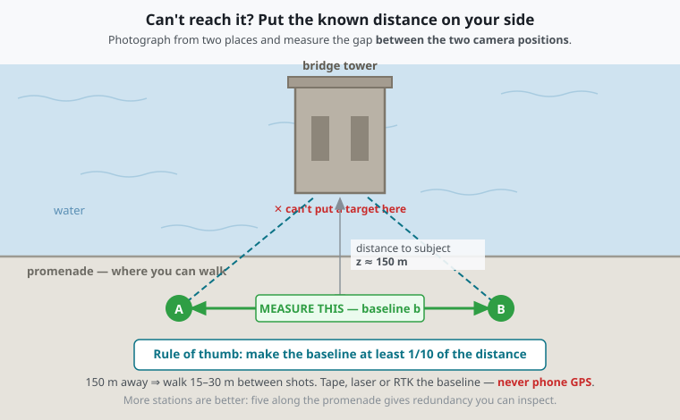

# 08 — Measuring What You Cannot Touch

How to scale a photograph of a subject you cannot place a target on: a bridge tower standing in
water, a cornice forty metres up, a facade across a live roadway.

Written in response to a specific question about the Brooklyn Bridge towers, but the framework
generalises.

---

## 1. The only four places scale can come from

This is the whole problem in one table. Scale is not something a camera knows; it has to be imported
from somewhere. There are exactly four sources.

| # | Source of scale | Needs | Typical accuracy |
|---|---|---|---|
| **1** | **An object of known size in the scene** | Physical access to the subject plane | 0.1–1 % |
| **2** | **A known camera-to-subject distance** | A rangefinder that can reach it | 0.2–2 % |
| **3** | **A known baseline between two camera stations** | Accessible ground on your side only | 0.5–3 % |
| **4** | **A published dimension of the subject** | A trustworthy document | inherits the document |

For an inaccessible subject, **method 1 is off the table** — which is exactly why it feels hard. The
answer is simply to use one of the other three. All of them work from where you are standing.

Everything below is elaboration on that table.

---

## 2. Method 3 — the two-station baseline (the workhorse)

**This is the classic answer and usually the right one.** It is how terrestrial photogrammetry scaled
everything for a century before anyone had a laser.

You cannot reach the tower. You *can* reach the ground you are standing on. So put the known distance
**on your side of the water**:



Photograph the tower from **A** and from **B**. Measure the distance **A→B** accurately. The
reconstruction is then scaled by that baseline — the subject never has to be touched.

### How long does the baseline need to be?

This is the part people get wrong, so here are the numbers. Depth uncertainty for a triangulated
point is approximately

```
σ_z  ≈  z² · σ_disparity / (f · b)
```

where `z` is distance to the subject, `f` the focal length in pixels, `b` the baseline, and
`σ_disparity` the matching precision. For a phone (`f ≈ 3000 px`, sub-pixel matching at 0.2 px):

| Baseline ↓ / Distance → | 10 m | 25 m | 50 m | 100 m | 200 m |
|---|---|---|---|---|---|
| **0.2 m** *(a projector bolted next to the camera)* | 33 mm | 208 mm | 833 mm | 3.3 m | 13.3 m |
| **1 m** | 7 mm | 42 mm | 167 mm | 667 mm | 2.7 m |
| **2 m** | 3 mm | 21 mm | 83 mm | 333 mm | 1.3 m |
| **5 m** | 1 mm | 8 mm | 33 mm | 133 mm | 533 mm |
| **10 m** | 1 mm | 4 mm | 17 mm | 67 mm | 267 mm |
| **25 m** | <1 mm | 2 mm | 7 mm | 27 mm | 107 mm |

**Read the diagonal.** A useful rule of thumb falls out of it:

> **Make the baseline at least 1/10 of the distance to the subject**, and preferably 1/5.

A tower 150 m away wants a **15–30 m** baseline. That is a comfortable walk along a promenade — which
is precisely what the Brooklyn Bridge Park and DUMBO waterfront give you.

### Measuring the baseline

In descending order of accuracy:

| Method | Accuracy over 20 m | Notes |
|---|---|---|
| Total station | ~1 mm | Overkill unless one is already on site |
| RTK GNSS, two occupations | 10–20 mm | The practical professional answer |
| Laser rangefinder A→B | 1–2 mm | Easiest if you have line of sight and a target plate |
| Steel tape, pulled taut | 5–20 mm | Fine, and cheap. Watch sag and slope |
| Phone GNSS | **1–5 m** | **Not acceptable.** This is the ~165 cm problem from doc 01 again |

Note the asymmetry that makes this method attractive: **the baseline is short and accessible, so you
can measure it well, even though the subject is far and unreachable.**

### Practical cautions

- **Both photographs must see the same features.** Convergent angles beyond ~30° start to break
  feature matching; keep the two views similar enough that the software can correspond them.
- **Do not change zoom between stations.** Different intrinsics between the two shots is a classic
  silent failure.
- **More than two stations is better.** Five stations along the promenade is a proper photo network
  and gives redundancy, which turns into residuals you can actually inspect.
- **The water is not a stable feature.** Match on the structure, never on waves or reflections.

---

## 3. Method 2 — range it

A reflectorless laser rangefinder solves the problem directly: measure the distance to the tower, and
scale follows from the pinhole model.

```
GSD (mm/px) = sensor_width_mm × distance_mm / (focal_mm × image_width_px)
```

- Consumer units (Leica DISTO class) reach **100–300 m**; the DISTO S910 is specified to 300 m. Outdoors
  in daylight you will want the **target plate** and a steady rest, because range and precision both
  degrade badly against a distant, dark, non-cooperative surface.
- Cheap reflectorless units can be **~1 m accurate at 200 m** — check the actual specification rather
  than the headline range, because "measures to 200 m" and "measures *accurately* to 200 m" are
  different claims.
- Granite and dark stone are poor reflectors. Aim at a light, flat, perpendicular face.
- On Android this integrates over **Web Bluetooth** — already the `CAL-5` tier in
  [02-calibration-methodology.md](02-calibration-methodology.md).

**Caveat that matters:** ranging gives you the distance to *one point*. A tower is not a plane at a
single distance — the near corner and the far corner differ by the tower's own depth. Range several
points, or combine with the baseline method.

---

## 4. Method 4 — use the published dimensions

You are right that landmark structures usually have documented dimensions, and this is a legitimate
scale source. The Brooklyn Bridge is documented as **HAER NY-18** with measured drawings at the
Library of Congress; the towers are ~278 ft (84.7 m) above mean high water.

Used carefully, a published dimension becomes an ordinary `CAL-2`/`CAL-3` known length — you just
identify the two points in the photograph rather than taping them yourself.

### Three rules that keep this honest

**1. You inherit the document's accuracy, and its date.**
A dimension scaled off a 1969 HAER sheet carries 1969's tolerance and 1969's geometry. Structures
settle, get re-decked, get repointed. Record the source, the sheet number, and the survey date.

**2. You have lost independence — do not then "confirm" the source.**
This is the trap. If you scale your photograph *from* a HAER dimension, your measurements can never
be evidence *about* that dimension. It is circular. They can still be excellent evidence about
everything else in the frame — spacing, condition, proportion, change over time — but the dimension
you scaled from is now an assumption, not a finding.

**3. Prefer a long, sharp, unambiguous dimension.**
Overall tower width beats a moulding profile: a long baseline in the image divides your pointing error
by a larger number, and a crisp masonry edge is locatable where a weathered profile is not.

### Consequence for the contract

This interacts directly with the `source-confidence` model in
[07-backend-and-twin-integration.md](07-backend-and-twin-integration.md). A capture scaled from a
published drawing is **not independent evidence** of that drawing's dimensions, and the manifest must
say so. The proposed field:

```jsonc
"scale_source": {
  "method": "published_dimension",     // in_scene_target | rangefinder | baseline | published_dimension
  "reference": "HAER NY-18, sheet 4",
  "value_mm": 25908.0,
  "stated_tolerance_mm": 50,
  "survey_date": "1969",
  "independent_of_source": false       // measurements cannot corroborate the source they came from
}
```

That last flag is the important one. Without it, a corroboration engine could count a Plumb capture as
independent agreement with HAER when it is nothing of the sort.

---

## 5. The projector idea

This is a good instinct, and it points at something real — but not quite in the way it first appears.
There are two separate problems with it, and they fail at very different scales.

### Problem 1: the physics is brutal (this kills it outdoors)

Illuminance falls with the **square** of throw distance, because the projected image area grows as
distance squared. For a 1.2 throw ratio, 16:9:

**Illuminance on the surface (lux)**

| Distance | 500 lm | 1500 lm | 3000 lm |
|---|---|---|---|
| 1 m | 1280 | 3840 | 7680 |
| 5 m | 51 | 154 | 307 |
| 10 m | 12.8 | 38 | 77 |
| 20 m | 3.2 | 9.6 | 19 |
| 50 m | 0.51 | 1.5 | 3.1 |
| 100 m | 0.13 | 0.38 | 0.77 |
| 200 m | 0.03 | 0.10 | 0.19 |

For comparison: direct sun 100,000 lux · overcast day 10,000 · sunset 400 · street lighting ~15 ·
**full moon 0.25**.

**Maximum usable throw** (pattern reaching 3× ambient, i.e. actually detectable):

| Conditions | 500 lm | 1500 lm | 3000 lm |
|---|---|---|---|
| Overcast daylight | **0.2 m** | **0.4 m** | **0.5 m** |
| Sunset | 1.0 m | 1.8 m | 2.5 m |
| Street-lit night | 5.3 m | 9.2 m | 13.1 m |
| Genuinely dark night | 41 m | 72 m | 101 m |

So: **in daylight, a battery projector reaches about half a metre.** Not a typo. And the East River
waterfront at night is emphatically *not* a dark site — Manhattan and Brooklyn are lit, so realistically
you are in the "street-lit night" row: **5–13 m**. A tower across water is out of reach by an order of
magnitude.

Note also that brightness buys you very little, because the relationship is a square root: going from
500 to 3000 lumens — six times the light, and a much heavier battery — only **2.4×** the distance.

### Problem 2: projection alone does not give you scale (this is the deeper issue)

Even if the pattern were perfectly visible, it would not solve the scale problem, because:

> The real-world size of a projected pattern **is** the throw distance divided by the throw ratio.

So to know how big the projected square is on the tower, you must already know how far away the tower
is. But if you know the distance, you can compute scale directly from the camera and the projector is
redundant. **It is circular.** The unknown has been moved, not removed.

### What a projector genuinely *is* good for

Having said all that, the underlying instinct — "put something of known geometry onto the surface" — is
sound, and there are three real uses:

1. **Adding texture for feature matching.** This is the strongest one. Blank concrete, smooth stone
   and glass defeat SfM because there is nothing to correspond between images. Projecting a random
   speckle gives the matcher something to lock onto. Note it improves *matching*, not *scale*.
2. **Rectification without scale.** A projected pattern of known *shape* still yields vanishing points
   and a homography up to an unknown scale factor — enough to square the image up.
3. **Structured light, properly done** — where the scale comes from a **calibrated baseline between
   projector and camera**, not from the pattern. This is how commercial structured-light scanners work,
   and the research is explicit that it "relies on precise alignment between the projector and camera."

But look at what #3 actually is: **triangulation from a known baseline.** It is method 3 from §2,
with a projector standing in for the second camera. And a projector bolted to a camera gives you a
baseline of perhaps 0.2 m — the top row of the table in §2, which is 3.3 m of error at 100 m.

> **The projector intuition is right, but the implementation is inverted.** You want a long baseline,
> and the cheapest long baseline is *walking twenty metres down the promenade and taking a second
> photograph*. That costs nothing, weighs nothing, needs no battery, and works in daylight.

### Where a projector *would* earn its place

To be fair to the idea — it is genuinely useful for:

- **Interiors and vaults** at 2–5 m, at night or in a dark space
- **Featureless surfaces** where SfM fails for want of texture
- **Tunnel, crypt and soffit work** where ambient light is already near zero

Worth revisiting if that work comes up. Not the answer for a tower in a river.

---

## 6. Other things worth having in the kit

| Technique | When it helps | Watch out |
|---|---|---|
| **Existing lidar / point clouds** | NYC publishes open lidar; HAER-era laser scans exist. Register the photograph to the cloud and inherit its scale | Inherits the cloud's date and accuracy — same independence caveat as §4 |
| **Tidal datum as a horizontal reference** | The waterline at a known timestamp is a contour at a known elevation. NOAA CO-OPS publishes East River levels, and the DUMBO twin already consumes them | The waterline is fuzzy: waves, wake, wet stone. Good for a datum, poor for a sharp edge |
| **Known nearby fixed objects** | Navigation markers, fender piles, a neighbouring building with documented dimensions | Must be genuinely fixed and genuinely documented. Boats move |
| **Drone** | The obvious answer, and gives real access | Regulatory reality near bridges and over water; the scale problem does not vanish, you still need control |
| **Sun angle and shadow length** | Exotic; a shadow on a known plane at a known time constrains height | Low accuracy. A curiosity, not a method |

---

## 7. Recommendation for the Brooklyn Bridge towers

Concretely, given the site:

1. **Primary: multi-station baseline** from Brooklyn Bridge Park / the DUMBO waterfront. Five or more
   stations spread over **20–40 m**, measured with a laser rangefinder or a taped baseline. At ~150 m
   to the tower this puts you in the tens-of-millimetres band — genuinely useful for a landmark record.
2. **Secondary: range the tower** from two or three stations to constrain distance directly and give
   the bundle adjustment something to hold on to.
3. **Cross-check, never scale-from: HAER NY-18.** Compare your result against the published dimensions.
   If they agree, that is meaningful *because you did not use them*. That is the whole reason to keep
   method 4 in reserve rather than reaching for it first.
4. **Record the waterline and timestamp** so the NOAA tidal datum can be recovered later.
5. **Everything gets `scale_source` in the manifest**, so a later reader can tell exactly where the
   millimetres came from.

The general principle, worth stating plainly:

> **Access constrains where you can put a ruler. It does not constrain where you can put a camera.**
> Move the known distance to the accessible side of the problem.
